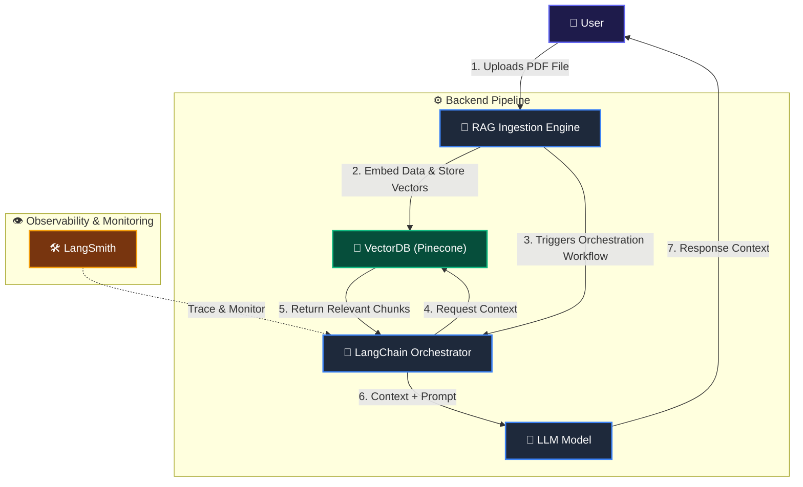

## 🏗️ System Architecture

```mermaid
flowchart TB
    User["👤 User"]

    subgraph Backend["⚙️ Backend Pipeline"]
        System["📄 RAG Ingestion Engine"]
        Pinecone["🌲 VectorDB (Pinecone)"]
        LangChain["🔗 LangChain Orchestrator"]
        LLM["🧠 LLM Model"]
    end

    subgraph Observability["👁️ Observability & Monitoring"]
        LangSmith["🛠️ LangSmith"]
    end

    %% Data Ingestion Flow
    User -- "1. Uploads PDF File" --> System
    System -- "2. Embed Data & Store Vectors" --> Pinecone
    System -- "3. Triggers Orchestration Workflow" --> LangChain

    %% RAG Retrieval & Generation Flow
    LangChain -- "4. Request Context" --> Pinecone
    Pinecone -- "5. Return Relevant Chunks" --> LangChain
    LangChain -- "6. Context + Prompt" --> LLM
    LLM -- "7. Response Context" --> User

    %% Monitoring Trace
    LangSmith -. "Trace & Monitor" .-> LangChain

    %% Styling for GitHub UI
    classDef primary fill:#1e293b,stroke:#3b82f6,stroke-width:2px,color:#fff
    classDef database fill:#064e3b,stroke:#10b981,stroke-width:2px,color:#fff
    classDef monitor fill:#78350f,stroke:#f59e0b,stroke-width:2px,color:#fff
    classDef userStyle fill:#1e1b4b,stroke:#6366f1,stroke-width:2px,color:#fff

    class LangChain,System,LLM primary
    class Pinecone database
    class LangSmith monitor
    class User userStyle
```